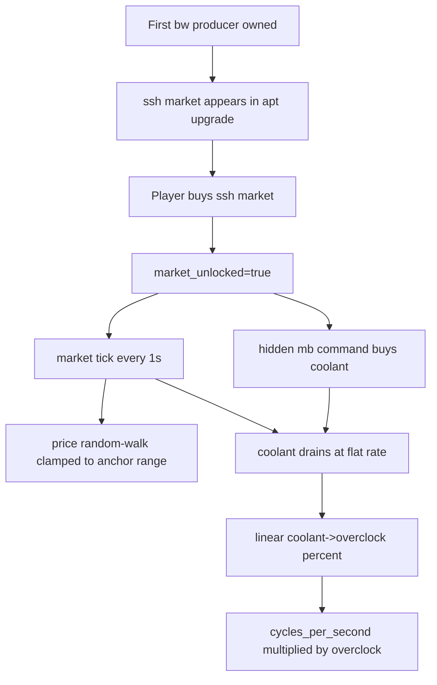

# Implement "the market" feature

## Confirmed product defaults

- Unlock trigger: first **owned** bandwidth-consuming producer (`bw_mbps > 0`, currently `KernelModule`).
- New permanent upgrade: `ssh market`, shown in `apt upgrade` once trigger is met; one-time cost `100,000 cycles`.
- Market tick: `1.0s` (config constant).
- Anchor price: `0.1%` of `total_cycles_earned` (config constant, arbitrary small decimal supported).
- Actionable price bounds: clamp to `[50%, 200%]` of anchor (config constants).
- Price movement: random-walk each market tick with step `5%` of current price (config constant).
- Coolant drain: flat `1 unit/s` (config constant), coolant floors at `0`.
- Overclock mapping: linear with breakpoints `0 coolant => 1%`, `100 coolant => 100%`, `1000 coolant => 200%` (all constants).
- Trend arrow: SMA crossover, `SMA(3)` vs `SMA(5)`.
- Hidden command: `mb` supports `*n` and `-max` and is omitted from help/menu listings.

## Code areas and planned changes

- Add market state and tunables in `[/home/lappy/projects/lazymin/crates/lazymin-core/src/game/state.rs](/home/lappy/projects/lazymin/crates/lazymin-core/src/game/state.rs)`
  - Add persisted market fields to `GameState` (`market_unlocked`, `coolant`, `coolant_price`, short price history ring buffer, market tick accumulator).
  - Add `#[serde(default)]` where needed for save compatibility.
- Add market simulation and overclock application in `[/home/lappy/projects/lazymin/crates/lazymin-core/src/game/tick.rs](/home/lappy/projects/lazymin/crates/lazymin-core/src/game/tick.rs)`
  - Introduce constants for all balancing knobs (anchor %, bounds, step %, tick interval, drain rate, overclock min/max and breakpoints).
  - Add `tick_market(state, delta_secs)` called from `tick(...)`.
  - Apply overclock multiplier into cycle production path (local production + remote path behavior explicitly documented in code).
  - Keep implementation upgrade-friendly by centralizing formulas in helper functions (for future upgrade modifiers).
- Add upgrade wiring in `[/home/lappy/projects/lazymin/crates/lazymin-core/src/game/upgrades.rs](/home/lappy/projects/lazymin/crates/lazymin-core/src/game/upgrades.rs)`
  - Add `UpgradeKind::SshMarket` + `UpgradeEffect::MarketUnlock`.
  - Register upgrade in `ALL` with command text/description.
  - Unlock condition checks first owned bandwidth-consuming producer.
  - In purchase application, set `market_unlocked = true` and initialize market price/history if needed.
- Add hidden buy command in `[/home/lappy/projects/lazymin/crates/lazymin-core/src/terminal/CommandDefs.rs](/home/lappy/projects/lazymin/crates/lazymin-core/src/terminal/CommandDefs.rs)` and `[/home/lappy/projects/lazymin/crates/lazymin-core/src/terminal/commands.rs](/home/lappy/projects/lazymin/crates/lazymin-core/src/terminal/commands.rs)`
  - Register `mb` as a normal command with `cost` callback returning current coolant unit price.
  - Implement `cmd_market_buy` to buy exactly one coolant per execution.
  - Do not add `mb` to `HELP_ORDER`, `LS_ORDER`, or apt menu order lists.
  - Reuse existing repeat/max purchase pipeline from `execute.rs`/`max_purchase.rs` (no modifier parser changes needed).
- Add MARKET panel rendering in `[/home/lappy/projects/lazymin/crates/lazymin-core/src/ui/layout.rs](/home/lappy/projects/lazymin/crates/lazymin-core/src/ui/layout.rs)` and `[/home/lappy/projects/lazymin/crates/lazymin-core/src/ui/mod.rs](/home/lappy/projects/lazymin/crates/lazymin-core/src/ui/mod.rs)`
  - Extend layout so left column splits into RESOURCES + MARKET only when unlocked.
  - MARKET panel line spec:
    - `coolant cost <n cycles> <arrow>`
    - averages labels line
    - averages values line (`10s`, `30s`, `60s` SMA)
    - `coolant <n>` left aligned
    - `overclock <n%>` left aligned
  - Keep current layout unchanged before unlock.
- Add/adjust tests
  - `upgrades.rs`: unlock condition and one-time behavior for `ssh market`.
  - `tick.rs`: price clamp bounds, random-walk progression, coolant drain floor, overclock multiplier mapping.
  - terminal command tests: `mb` affordability, `*n` and `-max` behavior, hidden from listing commands.
  - UI tests/snapshots (if present) for unlocked market panel rendering.

## Integration flow

## key implementation notes

- Keep market math in dedicated helpers to make future upgrade modifiers a simple extension instead of scattered conditionals.
- Use history buffers long enough for both trend (`SMA3/5`) and display averages (`10/30/60s`).
- Preserve save backward compatibility with defaults so older saves load cleanly.

